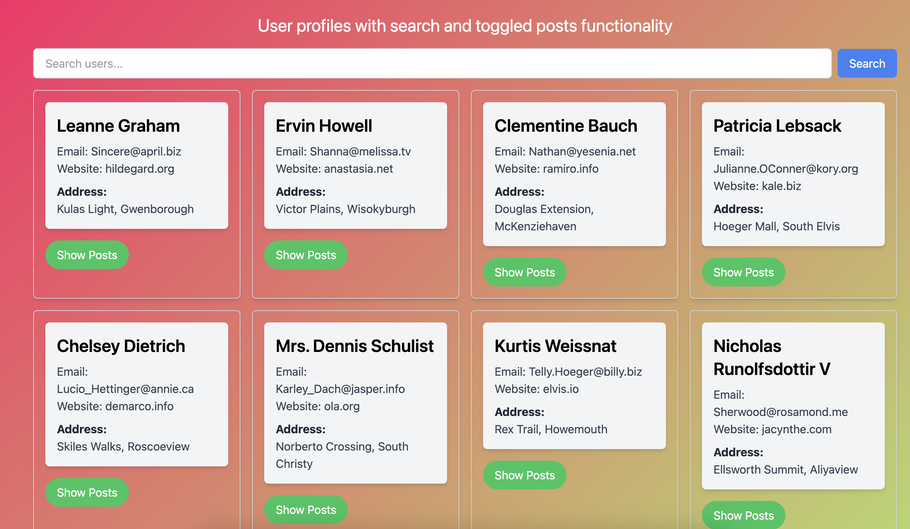

# User-Profiles

User profiles with search and toggled posts functionality.
Made with vuejs and tailwind css and uses {JSON} Placeholder API for fetching mock data

# Checkout the project deployed on vercel below

[User Profiles](https://user-profiles-with-posts-jre0nk71b.vercel.app/)

## Project setup

```
yarn install
```

### Compiles and hot-reloads for development

```
yarn serve
```

### Compiles and minifies for production

```
yarn build
```

### Lints and fixes files

```
yarn lint
```

# Screenshot:



### Customize configuration

See [Configuration Reference](https://cli.vuejs.org/config/).
